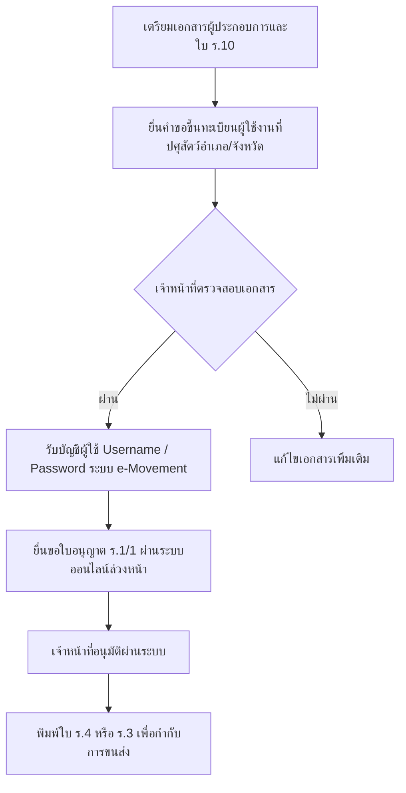

# รายชื่อโรงงานแปรรูปเนื้อไก่รายใหญ่และระบบขนส่งในประเทศไทย

## 1. โรงงานผู้ผลิตและแปรรูปไก่สดรายใหญ่ (Sourcing Directory)
ผู้ประกอบการสามารถติดต่อแผนกขายส่งเพื่อขอราคาดีลเลอร์ (Dealer Price) หรือราคาส่งหน้าโรงงาน (Ex-Factory Price) โดยมีรายใหญ่ดังนี้:

| รายชื่อบริษัท | แบรนด์หลัก | จุดเด่นของสินค้า | ช่องทางการติดต่อเบื้องต้น |
| :--- | :--- | :--- | :--- |
| **เครือเจริญโภคภัณฑ์ (CP Foods)** | CP, ห้าดาว | มาตรฐานสูงสุด, มีชิ้นส่วนหลากหลาย, มีสาขากระจายอยู่ทั่วประเทศ | ติดต่อแผนกขายส่งผ่าน CP Fresh Mart หรือสำนักงานใหญ่ |
| **เครือเบทาโกร (Betagro)** | Betagro, S-Pure | เน้นคุณภาพระดับพรีเมียม (โดยเฉพาะ S-Pure ที่ไม่ใช้ยาปฏิชีวนะ), ปศุสัตว์ OK | สำนักงานจำหน่ายของเบทาโกรประจำจังหวัด |
| **จีเอฟพีที (GFPT)** | GFPT | เชี่ยวชาญการชำแหละชิ้นส่วนไก่เพื่อการส่งออก มีมาตรฐานสากล | โรงชำแหละและแปรรูป จ.สมุทรปราการ |
| **สหฟาร์ม (Saha Farms)** | สหฟาร์ม | แหล่งผลิตขนาดใหญ่ราคาแข่งขันได้สูง เหมาะกับการซื้อปริมาณมาก | ฝ่ายขายส่งสำนักงานใหญ่ กรุงเทพฯ |
| **ไทยฟู้ดส์ กรุ๊ป (TFG)** | Thai Foods | โตเร็ว ราคาจับต้องได้ เหมาะกับตลาดหมูกระทะและร้านอาหารทั่วไป | ติดต่อฝ่ายขายตรงของไทยฟู้ดส์ |

---

## 2. ขั้นตอนการสมัครใช้งานระบบ e-Movement ของกรมปศุสัตว์
เพื่อขอใบอนุญาตเคลื่อนย้ายซากสัตว์ ร.3/ร.4 ผ่านระบบออนไลน์แบบสะดวก 24 ชั่วโมง:

### เอกสารที่ต้องใช้สมัคร e-Movement:
1. ใบอนุญาตทำการค้าซากสัตว์ (ร.10) ที่มีอายุการใช้งานปัจจุบัน
2. หนังสือรับรองนิติบุคคล (กรณีบริษัท/ห้างหุ้นส่วน) หรือสำเนาบัตรประชาชน/ทะเบียนบ้าน (บุคคลธรรมดา)
3. เอกสารรับรองมาตรฐานห้องเย็นพักซากสัตว์ (ถ้ามี)
4. ข้อมูลยานพาหนะที่จะใช้ขนส่ง (สำเนาทะเบียนรถยนต์/รถบรรทุกที่ติดตั้งตู้ห้องเย็น)

---

## 3. เช็คลิสต์ตรวจสอบและประเมินราคากลางไก่สด
ราคากลางไก่สดมีผลต่อการกำหนดอัตรากำไร (Margin) ผู้ประกอบการควรตรวจสอบราคาจากแหล่งข้อมูลเหล่านี้อย่างน้อยสัปดาห์ละ 2 ครั้ง:
- **เว็บไซต์สมาคมผู้เลี้ยงไก่เนื้อ:** รายงานสถานการณ์และราคากลางไก่มีชีวิตหน้าฟาร์ม
- **กรมการค้าภายใน (DIT):** รายงานราคาขายปลีกและขายส่งของสินค้าปศุสัตว์ในแต่ละภูมิภาค
- **ตลาดค้าส่งขนาดใหญ่:** เช่น ราคา ณ ตลาดไท, ตลาดสี่มุมเมือง ซึ่งสะท้อนความต้องการซื้อขายจริงในแต่ละวัน

---

## 4. แผนฉุกเฉินกรณีเกิดปัญหาระหว่างการขนส่งข้ามจังหวัด (Troubleshooting)

### เหตุการณ์ที่ 1: เครื่องทำความเย็นบนรถเสียระหว่างทาง
- **วิธีจัดการ:** 
  1. คนขับต้องรีบจอดรถในที่ร่มหรือปั๊มน้ำมันทันที ห้ามเปิดประตูตู้โดยเด็ดขาดเพื่อรักษาความเย็นเดิมไว้
  2. โทรประสานงานห้องเย็นเคลื่อนที่สำรอง (ตู้คอนเทนเนอร์เย็นเคลื่อนที่ หรือบริการรถเย็นด่วน) ในพื้นที่ใกล้เคียงเพื่อถ่ายสินค้า
  3. หากประเมินว่าอุณหภูมิภายในตู้สูงเกิน 8°C ให้ใช้น้ำแข็งป่นเทอัดทับตู้สินค้าเพื่อประคองอุณหภูมิแกนเนื้อไก่ไม่ให้เกิน 4°C

### เหตุการณ์ที่ 2: ถูกด่านตรวจปศุสัตว์กักรถและขอเอกสาร
- **วิธีจัดการ:**
  1. พนักงานขับรถต้องนำเอกสารใบ ร.4 (ใบอนุญาตเคลื่อนย้าย) และใบส่งสินค้าแสดงแก่เจ้าหน้าที่ทันที
  2. เลขทะเบียนรถ คับรถ และน้ำหนักสินค้าจริงในรถต้องตรงกับที่ระบุในใบ ร.4 ทุกประการ (หากน้ำหนักคลาดเคลื่อนเกิน ±5% อาจถูกกักตรวจละเอียด)
  3. หากพบปัญหาทางเอกสาร ให้รีบประสานงานฝ่ายจัดการเพื่อขอตรวจสอบในระบบ e-Movement ออนไลน์ด่วนที่สุดเพื่อยืนยันความถูกต้องกับด่านตรวจ
